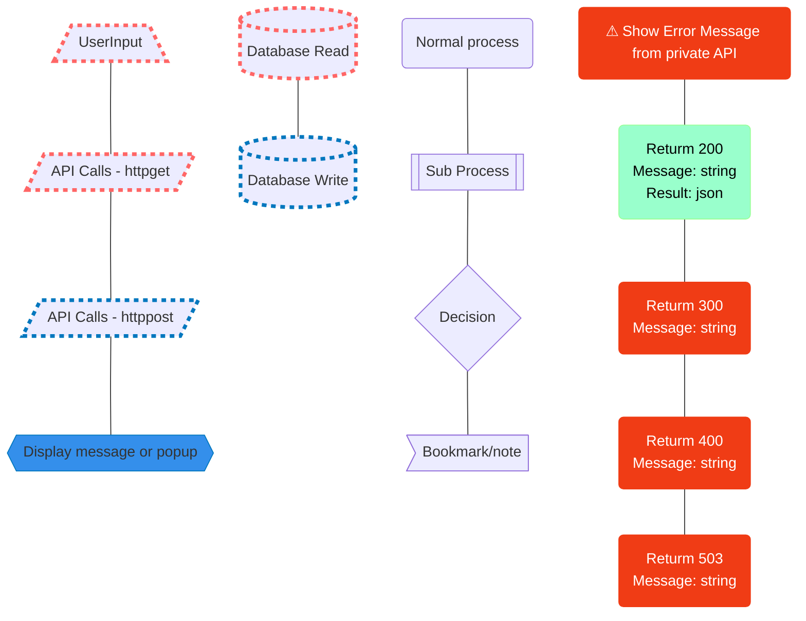

# MermaidDiagramKeys
Mermaid Diagram Keys

## Flowchart

```mermaid
flowchart TB

 UserInput[/"UserInput"\] --- ApiGet
 classDef userInput stroke:#f66,stroke-width:4px,stroke-dasharray: 5 5;
 
 ApiGet[/"API Calls - httpget"/]--- ApiPost
 classDef httpget stroke:#f66,stroke-width:4px,stroke-dasharray: 5 5;
 
 ApiPost[/"API Calls - httppost"/]---Display
 classDef httppost stroke:#0077be,stroke-width:4px,stroke-dasharray: 5 5;
 
 Display{{"Display message or popup"}}
 
 dbGet[("Database Read")]---dbPost[("Database Write")]
   
 Process("Normal process")---SubProcess[["Sub Process"]]---If{"Decision"}---Note>"Bookmark/note"]
  
 ShowErrorMessage("&#x26A0 Show Error Message from private API")---http200
 classDef errorMessage fill:#f03c15,stroke:#f03c15,color:#fff;
 
 http200("Returm 200\n Message: string \n Result: json")---http300
 classDef http200 fill:#99FFCC,stroke:#99FF99,color:#000;
 
 http300("Returm 300\n Message: string")---http400
 
 http400("Returm 400\n Message: string")---http500
 
 http500("Returm 503\n Message: string")
 classDef http500 fill:#f03c15,stroke:#f03c15,color:#fff;
 
 
 classDef blue fill:#348feb, stroke:#0077be,color:#fff; %%#348feb/#0077be
 
 class UserInput userInput
 class ApiGet,dbGet httpget
 class ApiPost,dbPost httppost
 class ShowErrorMessage errorMessage
 class http200 http200
 class http300,http400,http500 http500
 class Display blue
 
```
